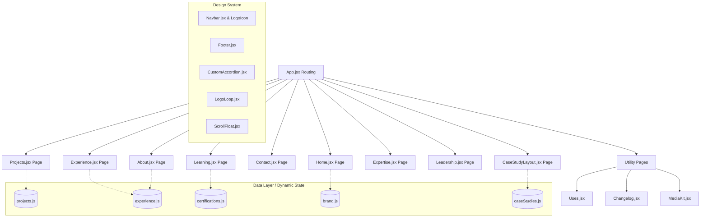

# Ma'ajo Lawasanjo — Digital Headquarters
[](https://vite.dev/)
[](https://react.dev/)
[](https://www.framer.com/motion/)
[](https://developer.mozilla.org/en-US/docs/Web/CSS)

A high-performance, modular, and premium developer portfolio showcasing engineering projects, academic credentials, venture leadership, and technical specialties. Designed with custom dark-mode-first glassmorphism, responsive navigation controls, and a dynamic data-driven architecture.

---

## 🏗 System Architecture Diagram

The portfolio is structured into a clean, modular React application where layout views, interactive visualizers, and page routes dynamically pull data from a structured JS data layer:



---

## 🌟 Key Features & Visual Systems

*   **Custom Brand Identity & SVG Logo**: Built an architectural geometric SVG `<LogoIcon />` rendering the "ML" monogram coupled with custom responsive headers.
*   **Specialty Visualizer Split-Layout**: Overhauled the interactive canvas on the landing page into a split layout separating educational value cards (role definitions, deliverables, value proposition statements) from high-fidelity visualizers (IDE, color palettes, AI network nodes).
*   **Responsive Top Hamburger + Bottom Menu Navigation**: Integrated a mobile hamburger slide-down overlay alongside standard desktop navigation menus and a thumb-friendly bottom mobile tab bar.
*   **Modular Data Layer**: Experiences, credentials, project timelines, and certifications are maintained in isolated data files under `/src/data/`, promoting easy updates and dynamic view synchronization.
*   **Interactive Learning & Credentials Ledger**: Showcases verified certifications (Azure AI Associate, AWS, Anthropic Claude, MIT Open Learning) alongside active study roadmaps.
*   **Dynamic Case Studies**: Deep technical walkthroughs for flagship products with challenge/solution grids, architecture breakdowns, and performance outcomes.

---

## 📁 Repository Structure

```directory
.
├── public/
│   ├── favicon.svg             # Custom geometric logo favicon
│   ├── icons.svg               # SVG asset compilation
│   └── resume.pdf              # Official CV
├── src/
│   ├── assets/                 # Brand assets and images
│   ├── components/
│   │   ├── layout/             # Global Navbar, Footer, and Navigation
│   │   ├── shared/             # Custom Accordion, LogoLoop, LogoIcon
│   │   └── ui/                 # ScrollFloat, SplitText animation utilities
│   ├── data/                   # Data layer (projects, experience, brand, certs)
│   ├── pages/                  # Primary and utility routing pages
│   ├── App.jsx                 # Routing and route configuration
│   ├── index.css               # Premium CSS design system and layout modules
│   └── main.jsx                # Application root mounting
├── index.html                  # Global index file
└── vite.config.js              # Vite bundler parameters
```

---

## 🛠 Local Setup & Development

### Prerequisites
*   Node.js (v18.0.0 or higher)
*   npm (v9.0.0 or higher)

### Installation Steps

1.  **Clone the Repository**:
    ```bash
    git clone https://github.com/Maajolawasanjo/MAAJO-LAWASANJO.git
    cd PORTFOLIO
    ```

2.  **Install Dependencies**:
    ```bash
    npm install
    ```

3.  **Start Development Server**:
    ```bash
    npm run dev
    ```
    Access the local server at `http://localhost:3000`.

4.  **Production Compilation**:
    ```bash
    npm run build
    ```
    This builds the optimized production assets inside the `/dist` directory.
